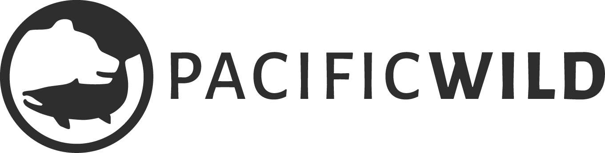
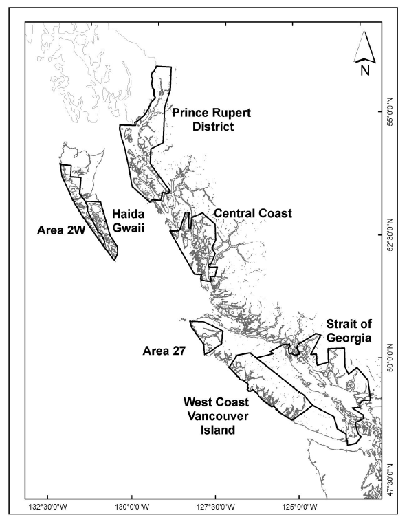

```{r setup, include=FALSE}
knitr::opts_chunk$set(echo = FALSE, warning = FALSE, message = FALSE)
options(knitr.kable.NA = '')
library(knitr)
library(tidyverse)
library(hrbrthemes)
library(bookdown)
library(plotly)
library(kableExtra)
library(ineq)
extrafont::loadfonts()
source("./R/cpi_function.R")
cpi <- read_csv("./Data/Canadian_CPI.csv") %>% 
  mutate(base_year=2002) %>% 
  select(-InflationRate)
cpi_2015 <- inflation_adjust(cpi, 2015) %>% 
  rename(Year=year)
#theme_set(theme_ipsum()) # Doesn't work on PC because it's missing Arial Narrow font.
theme_set(theme_ipsum_rc() + 
            theme(text=element_text(family="Alegreya Sans"),
                  axis.title.x = element_text(family="Alegreya Sans"),
                  axis.title.y = element_text(family="Alegreya Sans")
                  ))
plot_font <- list(
  family = c("Alegreya Sans", "Alegreya Sans Regular", "Open Sans"),
  familysrc = "http://fonts.googleapis.com/css?family=Alegreya+Sans")


number_call <- function(num, decimals){
  x <- prettyNum(num, big.mark = ",", small.mark = ".", digits=decimals) 
  return(x)
}

short_to_metric_multiplier <- 2000 /2204.623

#ipsum(number_sections = TRUE)
# bookdown::gitbook: 
#     self_contained: true
#     split_by: "none"
#     download: ["pdf"]

```

```{css, echo=FALSE}

body {
   font-family: "Alegreya Sans", sans-serif;
   font-size: 14px;
   line-height: 1.6;
   padding-top: 10px;
   padding-bottom: 10px;
   background-color: white;
   padding: 30px; }

body > *:first-child {
   margin-top: 0 !important; }
body > *:last-child {
   margin-bottom: 0 !important; }

a {
   color: #4183C4; }
a.absent {
   color: #cc0000; }
a.anchor {
   display: block;
   padding-left: 30px;
   margin-left: -30px;
   cursor: pointer;
   position: absolute;
   top: 0;
   left: 0;
   bottom: 0; }

h1, h2, h3, h4, h5, h6 {
   margin: 20px 0 10px;
   padding: 0;
   font-weight: bold;
   -webkit-font-smoothing: antialiased;
   cursor: text;
   position: relative; }

h1:hover a.anchor, h2:hover a.anchor, h3:hover a.anchor, h4:hover a.anchor, h5:hover a.anchor, h6:hover a.anchor {
   text-decoration: none; }

h1 tt, h1 code {
   font-size: inherit; }

h2 tt, h2 code {
   font-size: inherit; }

h3 tt, h3 code {
   font-size: inherit; }

h4 tt, h4 code {
   font-size: inherit; }

h5 tt, h5 code {
   font-size: inherit; }

h6 tt, h6 code {
   font-size: inherit; }

h1 {
   font-size: 28px;
   color: black; }

h2 {
   font-size: 24px;
   border-bottom: 1px solid #cccccc;
   color: black; }

h3 {
   font-size: 18px; }

h4 {
   font-size: 16px; }

h5 {
   font-size: 14px; }

h6 {
   color: #777777;
   font-size: 14px; }

p, blockquote, ul, ol, dl, li, table, pre {
   margin: 15px 0; }

hr {
   border: 0 none;
   color: #cccccc;
   height: 4px;
   padding: 0;
}

body > h2:first-child {
   margin-top: 0;
   padding-top: 0; }
body > h1:first-child {
   margin-top: 0;
   padding-top: 0; }
body > h1:first-child + h2 {
   margin-top: 0;
   padding-top: 0; }
body > h3:first-child, body > h4:first-child, body > h5:first-child, body > h6:first-child {
   margin-top: 0;
   padding-top: 0; }

a:first-child h1, a:first-child h2, a:first-child h3, a:first-child h4, a:first-child h5, a:first-child h6 {
   margin-top: 0;
   padding-top: 0; }

h1 p, h2 p, h3 p, h4 p, h5 p, h6 p {
   margin-top: 0; }

li p.first {
   display: inline-block; }
li {
   margin: 0; }
ul, ol {
   padding-left: 30px; }

ul :first-child, ol :first-child {
   margin-top: 0; }

dl {
   padding: 0; }
dl dt {
   font-size: 14px;
   font-weight: bold;
   font-style: italic;
   padding: 0;
   margin: 15px 0 5px; }
dl dt:first-child {
   padding: 0; }
dl dt > :first-child {
   margin-top: 0; }
dl dt > :last-child {
   margin-bottom: 0; }
dl dd {
   margin: 0 0 15px;
   padding: 0 15px; }
dl dd > :first-child {
   margin-top: 0; }
dl dd > :last-child {
   margin-bottom: 0; }

blockquote {
   border-left: 4px solid #dddddd;
   padding: 0 15px;
   color: #777777; }
blockquote > :first-child {
   margin-top: 0; }
blockquote > :last-child {
   margin-bottom: 0; }

table {
   padding: 0;border-collapse: collapse; }
table tr {
   border-top: 1px solid #cccccc;
   background-color: white;
   margin: 0;
   padding: 0; }
table tr:nth-child(2n) {
   background-color: #f8f8f8; }
table tr th {
   font-weight: bold;
   border: 1px solid #cccccc;
   margin: 0;
   padding: 6px 13px; }
table tr td {
   border: 1px solid #cccccc;
   margin: 0;
   padding: 6px 13px; }
table tr th :first-child, table tr td :first-child {
   margin-top: 0; }
table tr th :last-child, table tr td :last-child {
   margin-bottom: 0; }

img {
   max-width: 100%; }

span.frame {
   display: block;
   overflow: hidden; }
span.frame > span {
   border: 1px solid #dddddd;
   display: block;
   float: left;
   overflow: hidden;
   margin: 13px 0 0;
   padding: 7px;
   width: auto; }
span.frame span img {
   display: block;
   float: left; }
span.frame span span {
   clear: both;
   color: #333333;
   display: block;
   padding: 5px 0 0; }
span.align-center {
   display: block;
   overflow: hidden;
   clear: both; }
span.align-center > span {
   display: block;
   overflow: hidden;
   margin: 13px auto 0;
   text-align: center; }
span.align-center span img {
   margin: 0 auto;
   text-align: center; }
span.align-right {
   display: block;
   overflow: hidden;
   clear: both; }
span.align-right > span {
   display: block;
   overflow: hidden;
   margin: 13px 0 0;
   text-align: right; }
span.align-right span img {
   margin: 0;
   text-align: right; }
span.float-left {
   display: block;
   margin-right: 13px;
   overflow: hidden;
   float: left; }
span.float-left span {
   margin: 13px 0 0; }
span.float-right {
   display: block;
   margin-left: 13px;
   overflow: hidden;
   float: right; }
span.float-right > span {
   display: block;
   overflow: hidden;
   margin: 13px auto 0;
   text-align: right; }

code, tt {
   margin: 0 2px;
   padding: 0 5px;
   white-space: nowrap;
   border: 1px solid #eaeaea;
   background-color: #f8f8f8;
   border-radius: 3px; }

pre code {
   margin: 0;
   padding: 0;
   white-space: pre;
   border: none;
   background: transparent; }

.highlight pre {
   background-color: #f8f8f8;
   border: 1px solid #cccccc;
   font-size: 13px;
   line-height: 19px;
   overflow: auto;
   padding: 6px 10px;
   border-radius: 3px; }

pre {
   background-color: #f8f8f8;
   border: 1px solid #cccccc;
   font-size: 13px;
   line-height: 19px;
   overflow: auto;
   padding: 6px 10px;
   border-radius: 3px; }
pre code, pre tt {
   background-color: transparent;
   border: none; }

sup {
   font-size: 0.83em;
   vertical-align: super;
   line-height: 0;
}
* {
	 -webkit-print-color-adjust: exact;
}
@media screen and (min-width: 914px) {
   body {
      width: 854px;
      margin:0 auto;
   }
}
@media print {
	 table, pre {
		  page-break-inside: avoid;
	 }
	 pre {
		  word-wrap: break-word;
	 }
}

```

### About the Author
Tim Cashion is a PhD student studying fisheries economics at the University of British Columbia, under the supervision of Rashid Sumaila. Tim\'s research at the Institute for Resources, Environment and Sustainability and the Institute for the Oceans and Fisheries is on environmental and economic trade-offs in fisheries, especially focusing on the impacts of fishing gear and reduction fisheries. Recently, Tim has worked for the Sea Around Us at UBC working on various projects, including fish used for fishmeal and fish oil, analyzing trends in fisheries discards, and researching global fisheries gear use. Tim received a double major BA from Huron University College at the University of Western Ontario. Tim began his fisheries research during his masters at Dalhousie University, focusing on the environmental and ecological impacts of reduction fisheries and seafood life cycle assessment.


Pacific Wild is a non-profit conservation organization based in British Columbia. We are committed to defending wildlife and their habitat on Canada's Pacific Coast by developing and implementing conservation solutions in collaboration with First Nations communities, scientists, other organizations and individuals. Recently, we worked alongside the Heiltsuk First Nation to document the crucial importance of Pacific herring to the ecological and cultural integrity of British Columbia's Central Coast.


```{r PW-logo, fig.align = 'center'}


```


```{r}
#Notes:
#Update bibliography and check references
#Add sources for all figures. 

```


# Executive Summary

The Pacific herring roe fishery (also known as the \‘sac roe\’ fishery) is a longstanding fishery in areas all along the B.C. coast. In recent years, the commercial catch from the Strait of Georgia contributed an increasing proportion of the province-wide catch. As of 2019, the only remaining management area with a commercial herring roe fishery is the Strait of Georgia. Here, we investigate the economic value of the fishery within the context of its history and other fisheries in the region. 
In general, landings, overall value, and prices have declined for the sector over the past 30 years. This is a challenge to the B.C. seafood industry for several reasons. The herring roe fishery has a strategic importance to the fisheries and seafood processing sector, due to the employment it generates in the off-season. The decrease in herring roe catches has led to decreases in employment in the fish processing and export sectors. Those invested in the fishery have seen the decline in value as the licences and lease costs have decreased substantially with the decline in value of the herring catch. 
Compared to other valuable species caught in the Strait of Georgia, herring catches are higher in tonnage but lower in value. In 2016, when catches were comparable, wild salmon fisheries generated 5.4 times as many processing jobs as herring fisheries and paid approximately 4 times as much in wages.
At the recent peak of the herring roe fishery, in 1989, coast-wide landings exceeded 4 million tonnes, worth \$128 million for fishers (or \$3.17 per kg). At this time, there were 427 full time-equivalent jobs in the fishery. Following a recent low in 2011, coast-wide landings increased to approximately 2 million tonnes in 2017. This catch was worth \$17.2 million to fishers (or \$0.84 per kg), and the fishery generated 216 full time-equivalent jobs.
In 2015, seine and gillnet (full fee) licence values for the herring roe fishery were at recent lows of \$25,000 and \$50,000, respectively, compared to \$199,000 and \$962,000 values for seine and gillnet licenses, respectively, in 2000. Currently, the lease values of licenses are near zero. There has been a significant increase in the inequality of the herring licenses through time. The largest corporate owner of herring roe licenses is the Pattison Group, which owns 30% of seine and 12% of gillnet licenses.  
Finally, we investigate the costs of closing the fishery for the 2019 season, as a proposed means of herring stock recovery and protection of other species that rely on them. Notably, we observed that the cost of license reimbursements, license buy-backs, or employment insurance payments for fishers were unlikely to be prohibitive, if the commercial fishery were closed to conserve the herring population, because of current low license value and relatively few full time-equivalent jobs.
 

## Notes on Terms
- Ex-vessel value is the value of fish or seafood at its first point of sale (i.e., the price the fishers receive). Also known as the landed value.
- Unless otherwise stated, all values are expressed in real 2015 dollars to account for inflation over the time period studied. 
- Tonnes refers to metric tonnes (1000 kilograms or 2204.6 lbs). Some data sources use short tons (2000 lbs) and this was converted to metric tonnes when necessary. 

# Introduction

The Pacific herring (*Clupea pallasii*) roe fishery (sometimes referredd to as the \'sac roe\' fishery) has a long history in British Columbia and is a valuable part of B.C.\'s seafood exports. This fishery makes up the largest component of the Pacific herring fisheries in B.C., with respect to the quantity of fish harvested and also the value of the catch. The fisheries that harvest Pacific herring in B.C. include: roe herring undertaken with purse seines and gillnets, food and bait herring caught with purse seines, herring spawn on kelp, and special use herring captured with multiple methods. Each of these has their own specific (or multiple) licences within the category that allow fishers to fish for this purpose. This report focuses specifically on the seine and gillnet roe fishery, while including the food and bait fishery and spawn on kelp fisheries when important for context. We also focus on one key fishing ground for the roe fishery, the Strait of Georgia (Figure \@ref(fig:map)), where the fishery has been especially concentrated in recent years. 

```{r map, echo=FALSE, fig.cap="Figure 1. Map of roe herring fishing areas in British Columbia. Source: Fisheries and Oceans Canada, 2018.", out.width = '50%'}
#Probably need a map of the area here. 

```

# The Fisheries
In the 1950s and early 1960s,  the Pacific herring fishery was the largest fishery in B.C. with catches often exceeding 200,000 tonnes [@HerringSchool2015]. In 1968, the B.C. herring populations collapsed, and fisheries were closed coast-wide [@HerringSchool2015]. Until that point, most of the fishery was used for the production of fishmeal and fish oil to support agriculture and livestock. The fishery was re-started in the 1970s with smaller catches destined for a high-value export of roe to the Japanese market. This fishery has proceeded to today being the main component of the herring fishery in B.C. (Figure \@ref(fig:catch-by-type)), with other fisheries being of much less importance by catch and value. The exception to this is the spawn on kelp fishery which is fished both commercially and as a Food, Social, and Ceremonial (FSC) fishery by First Nations in B.C., for whom herring are an important source of nourishment and cultural value. The second largest component of the herring fishery in B.C. is the food and bait fishery. There are several other herring fisheries that fall under special use licences and are much smaller in tonnage and value than the three aforementioned components. They include human food and bait, sport fishing bait, personal use and fish for zoos and aquaria. Here we focus on the economically most important fishery: the herring roe fishery (Figure \@ref(fig:roe-fishery-sog)). 

```{r catch-by-type, echo=F, warning=F, message=F, fig.cap="Catch of herring by fishery type. Source: B.C. Ministry of Agriculture, 2018."}
##Plots of catch, landed value, and wholesale values
fisherytype_value <- read_csv("./Data/HerringValueFisheries.csv")
fisherytype_value <- fisherytype_value %>%
  mutate_if(is.character, as.factor) %>%
  filter(Fishery != "Total") %>% 
  left_join(cpi_2015) %>% 
  mutate(Value= if_else(str_detect(Measure, pattern=" value"), Value*adj_value, Value))

fisherytype_value_plot <- fisherytype_value %>%
  filter(Measure=="Landings") %>% 
  ggplot(aes(x=Year,y=Value, color=Fishery)) +
  geom_line() +
  ylab("Landings (thousand tonnes)") + 
  # scale_y_continuous(expand=c(0,0)) + 
  # scale_x_continuous(labels=c(seq(2001, 2018, 4)), expand=c(0,0)) +
  scale_color_ipsum() + 
  NULL

ggsave("./Images/Catch of herring by fishery type. Source: BC Ministry of Agriculture, 2018.tiff", fisherytype_value_plot, dpi=300)

ggplotly(fisherytype_value_plot) %>% layout(font=plot_font)
```


For the 2019 season, the expected catch across all herring fisheries is approximately 30,000 tonnes (Figure \@ref(fig:bar-chart-area-use)). The only statistical areas open to the gillnet and seine roe fisheries are within the Strait of Georgia. Outside the Strait of Georgia, there are small fisheries as part of First Nations and commercial spawn on kelp fisheries (SOK), as well as Food, Social, and Ceremonial (FSC) fisheries. Other special use herring fisheries are predicted to total approximately 800 tonnes. Grouping these together, the only commercial fishing for herring outside the Strait of Georgia is for commercial spawn on kelp. 

```{r bar-chart-area-use, echo=F, warning=F, message=F, fig.cap="Expected catches (metric tonnes) of herring by area and fishery for the 2019 season areas. CC: Central Coast; HG: Haida Gwaii; PR: Prince Rupert; SOG: Strait of Georgia; WCVI: West Coast Vancouver Island. FSC: Food, Social, and Ceremonial; SOK: Spawn on Kelp. Source: DFO, 2018"}
expected_2019 <- read.csv("./Data/Herring2019SeasonExpectedUse.csv")
expected_2019_melt <- gather(expected_2019, key="Fishery", value=value, -Area, -AreaRegion)
fishery_types <- expected_2019_melt %>% filter(Area=="FisheryType") %>% 
  select(c(Fishery,value)) %>% 
  rename(FisheryGroup=value)
expected_2019_melt <-  expected_2019_melt %>% filter(!(Area=="FisheryType"))
expected_2019_melt$value[is.na(expected_2019_melt$value)] <- 0
expected_2019_melt <- expected_2019_melt %>% 
  left_join(fishery_types)
expected_2019_melt <- expected_2019_melt %>% 
  filter(is.na(FisheryGroup)==F) %>% 
  mutate(value=as.numeric(as.character(value)))
expected_2019_melt$value[is.na(expected_2019_melt$value)] <- 0
expected_2019_melt$value <- round(expected_2019_melt$value *short_to_metric_multiplier, 1)


expected_2019_summary <- expected_2019_melt %>% 
  ungroup() %>% 
  group_by(AreaRegion, FisheryGroup) %>% 
  summarize(value=sum(value)) %>% 
  arrange(desc(value))

expected_2019_summary <- expected_2019_summary %>% 
  mutate(FisheryGroup = fct_relevel(FisheryGroup, c("Food and bait", "Roe"), after=4))

expected_2019_summary_plot <- expected_2019_summary  %>% 
  ggplot(aes(x=AreaRegion, y=value, fill=FisheryGroup)) +
  geom_col() +
  scale_fill_ipsum() + 
  ylab("Expected use (metric tonnes)") +
  xlab("") + 
  labs(fill="Fishery group") +
  NULL

ggsave("./Images/Expected catches (metric tonnes) of herring by area and fishery for the 2019 season areas.tiff", dpi=300)

ggplotly(expected_2019_summary_plot) %>% layout(font=plot_font)

```


```{r roe-fishery-sog, echo=F, warning=F, message=F, fig.cap="Roe herring landings by gear in the Strait of Georgia. Source: Compiled season summary data from DFO reports."}
season_summary <- read_csv("./Data/herring_season_summaries.csv")

fisheries <- c("Roe herring", "Food and Bait")
fisheries <- c("Roe herring") #Exlcuding food and bait for now. 

catch_measures <- c("Quota Issued", "Landings")

season_summary <- season_summary %>%
  filter(Fishery %in% fisheries) %>% 
  filter(Measure %in% catch_measures)

season_summary$Value <- gsub(season_summary$Value, pattern="0\\*", replacement="0")
season_summary$Value <- gsub(season_summary$Value, pattern="-", replacement="0")
season_summary$Value <- gsub(season_summary$Value, pattern=",", replacement="")
season_summary$Value <- gsub(season_summary$Value, pattern="\\*N/A", replacement="")
season_summary$Value <- as.numeric(season_summary$Value)
season_summary$Value <- season_summary$Value * short_to_metric_multiplier #Convert from short tons to tonnes

season_summary$Fishery[is.na(season_summary$Gear)==F] <- paste(season_summary$Gear[is.na(season_summary$Gear)==F], str_to_lower(season_summary$Fishery[is.na(season_summary$Gear)==F]), sep= " ")

season_summary_plot <- season_summary %>% 
  filter(Area=="Strait of Georgia") %>% 
  ggplot(aes(x=Year,y=Value)) +
  geom_line(aes(color=Fishery)) +
  stat_summary(fun.y = sum, na.rm = TRUE, aes(group = 3, color = 'Total', label="Total"), geom ='line') + 
  ylab("Amount (tonnes)") + 
  scale_y_continuous(expand=c(0,0)) + 
  scale_color_ipsum() + 
  NULL
#plot(season_summary_plot)
ggsave("./Images/Roe herring landings by gear in the Strait of Georgia. Source: Compiled season summary data from DFO reports.tiff", dpi=300)

ggplotly(season_summary_plot) %>% layout(font=plot_font)

```


# The Products
The main product of the roe fishery is the herring roe, or the eggs of the female fish. The roe is exported in both frozen and cured forms to Japan. In general, the decline in ex-vessel prices for herring in B.C. is attributed to a decline in demand from the Japanese market, potentially caused by a weakened Japanese economy and a change in tastes from older to younger generations [@Newell1999]. There is a growing share of herring products exported outside of Japan, mainly to China and the USA [@DFO2018]. 

```{r by-product-calculations}
roe_weight <- .125 #This is the value used by McGrath et al. 2015 and not far from what I hear from the industry. 
#Talked with direct of sales at Canfisco. He said the range is from 11-16% with gillnet having a higher average 14-16%, and seine having lower (11-13%) due to their selectivity for larger fishes
#Keegan McGrath uses a value of 12.5% in his study with 87.5% destined for by-product meal. 
carcass_weight <- 1 - roe_weight 
carcass_value <- 1 #Unknown at present 


#In 2007 (Pelletier et al. 2007), 4.1 kg/tonne of pacific herring by-product meal and 3.1 kg/tonne of pacific herring by-product oil were used per tonne of salmon feed used in B.C.. Average use was 1.313 tonnes of feed per 1 tonne of live-weight salmon produced. 


#In 2013 (McGrath et al. 2015), average Canadian salmon feed is modelled as FM=18.4% (13.4% from anchoveta and 5.0% from Pacific herring) and FO=9.8% (5.0% gulf menhaden, 2.4% anchoveta, 2.4% pacific herring). This Pacific herring is modelled as solely from by-products of the roe fishery. 

canadian_fcr <- 1.313 #Pelletier 2009. Could be lower now. 
canadian_fcr <- 1.1 #Could be lower now?

bc_seafood <- read_csv("./Data/BC_Seafood_Production.csv")
bc_seafood$System <- "Wild"
bc_seafood$System[grepl(bc_seafood$Group , pattern="Farmed", ignore.case=T)] <- "Farmed"
bc_seafood$Group <- gsub(bc_seafood$Group, pattern=" .*", replacement = "")

bc_farmed_salmon_prod <- 1000* mean(bc_seafood %>%
                         filter(System=="Farmed") %>% 
                         filter(Group=="SALMON") %>%
                         filter(Species=="Atlantic") %>% 
                         filter(Measure=="HARVEST (000 Tonnes)") %>% 
                         pull(Value)) #Average of BC farmed Atlantic prod from 2014-2016. 
fm_yield <- .19 #Using value from McGrath 2015 which may be biased downwards because it includes Pacific hake. 
fo_yield <- 0.05 #Using average values for now. Look at Pelletier 2009.
herring_fm_perc <- 5
herring_fo_perc <- 2.4

herring_fm_of_feed <- herring_fm_perc/100 #Using value from McGrath 2015
herring_fo_of_feed <- herring_fo_perc/100 #Using value from McGrath 2015
herring_fm_req <- (canadian_fcr * bc_farmed_salmon_prod * herring_fm_of_feed)
herring_req <- herring_fm_req * (1/fm_yield)


catch <- read_csv("./Data/FinfishOutputData_Clean.csv")
catch <- catch %>% mutate(TONNES=AMOUNT/1000) %>% 
  rename(Year = YEAR)
herring_sum <- catch %>% 
  filter(grepl(SPECIES, pattern="HERRING|SPAWN")) %>% 
  group_by(SPECIES_GROUP, SPECIES, Year, GEAR) %>%
  summarize(TONNES = sum(TONNES),
            VALUE = sum(VALUE)) %>%
  mutate(FISHERY = paste(SPECIES, GEAR, sep="/"))
roe_herring_2014_2015 <- (1/2) *  sum(herring_sum %>% 
  filter(Year >= 2014 & Year <=2016) %>% 
  filter(SPECIES=="ROE HERRING") %>% 
  pull(TONNES)) #Average across two years

herring_fm_prod <- roe_herring_2014_2015 * carcass_weight * fm_yield
herring_fo_prod <- roe_herring_2014_2015 * carcass_weight * fo_yield


herring_meal_price <- 2.069299e+03 * 1.30 #FAO USD price (multiplied by 1.30 to convert to CAD) for Canadian herring meal exports in 2016. 
herring_oil_price <- 2419.7531 * 1.30

#This price could be improved with a number from WCL Redux if possible. 
#Index Mundi: Peruvian fishmeal prices 
# Month	Price	Change
# Dec 2017	1,887.88	-
# Jan 2018	1,985.20	5.15 %
# Feb 2018	2,019.22	1.71 %
# Mar 2018	2,074.66	2.75 %
# Apr 2018	2,007.17	-3.25 %
# May 2018	1,946.44	-3.03 %

herring_fm_prod_value <- herring_fm_prod * herring_meal_price
herring_fo_prod_value <- herring_fo_prod * herring_oil_price
redux_value <- (herring_fm_prod_value + herring_fo_prod_value)/1000000 #Reduction products are worth 8.6 million

herring_fm_req <- prettyNum(canadian_fcr * bc_farmed_salmon_prod * herring_fm_of_feed, big.mark = ",", small.mark = ".", digits=0) 
herring_fm_prod <- prettyNum(roe_herring_2014_2015 * carcass_weight * fm_yield, big.mark = ",", small.mark = ".", digits=0) 


```


While the roe are the backbone of the fishery, the majority by weight is the by-product of herring carcasses, which are processed into fishmeal and fish oil. There is limited information on the value of the carcasses, but according to one processor contacted during this study, carcasses generate no income for the processing company; rather, they are picked up by a reduction company for no cost. By all accounts, the carcasses from the roe herring fishery are reduced to produce fishmeal and fish oil in B.C. The fishmeal and fish oil are used primarily to produce salmon feed that is fed to B.C. farmed Atlantic salmon [@McGrath2015a]. Using information about the average industry aquaculture feed composition obtained from McGrath and colleagues (2015), we can estimate the amount of fishmeal produced on average from the roe herring fishery, and the amount likely required by the B.C. farmed salmon industry. 

The carcass weight that is used for fishmeal is between 84% and 89% of the landed weight [@McGrath2015a; @Anonymous2018]. The feed conversion ratio (FCR), or the ratio of feed used per unit output of salmon, for farmed Atlantic salmon in B.C. was 1.313 in 2009 [@Pelletier2009]. The average annual amount of farmed Atlantic salmon produced in B.C. was `r number_call(bc_farmed_salmon_prod, 5)` tonnes from 2014 to 2016 [@AgriServiceBC2017]. A standard B.C. salmon feed contains `r number_call(herring_fm_perc, 1)`% herring by-product meal and `r number_call(herring_fo_perc, 1)`% herring by-product oil [@McGrath2015a]. Thus, we can estimate the herring fishmeal required:  
Herring FM Demand = FCR \* Salmon Production \* Herring FM %  
Herring FM Demand = 1.313 \* `r number_call(bc_farmed_salmon_prod, 5)` tonnes \* `r number_call(herring_fm_perc, 1)`%  

We estimate the herring by-product meal demand to be `r number_call(herring_fm_req, 1)` tonnes. Alternatively, we can estimate the amount of herring fishmeal and fish oil produced from the roe fishery by-products using the carcass weight an average roe herring landings for a similar time period (averaged for 2014 and 2015):  
Herring FM Supply = Roe herring landings \* Carcass weight \* Fishmeal yield  
Herring FM Supply = `r number_call(roe_herring_2014_2015, 1)` tonnes \* `r number_call(carcass_weight*100, 1)`% \* `r number_call(fm_yield*100, 1)`%  

Herring FO Supply = Roe herring landings \* Carcass weight \* Fish oil yield  
Herring FO Supply = `r number_call(roe_herring_2014_2015, 1)` tonnes \* `r number_call(carcass_weight*100, 1)`% \* `r number_call(fo_yield*100, 1)`%  

We estimate the herring by-product meal and oil supply as `r number_call(herring_fm_prod, 0)` and `r number_call(herring_fo_prod, 0)` tonnes, respectively. Based on current export prices for herring meal (CAD `r number_call(herring_meal_price, 0)` per tonne) and herring oil (CAD `r number_call(herring_oil_price, 0)` per tonne) from Canada [@FAO2016a] (which may include Atlantic herring as well as Pacific herring), the value of these combined products is estimated to be `r number_call((herring_fm_prod_value+herring_fo_prod_value)/1000000, 2)` million CAD. 

The demand for herring fishmeal and fish oil by BC farmed salmon aquaculture vary year to year based on the farmed salmon production amount and herring inclusion rates in salmon feeds. However, the consistent demand for herring by-product meal and oils from the salmon aquaculture feed sector implies that this sector is the major user of the herring by-products produced from the roe fishery. In years where herring meal demand is estimated to exceed supply from the roe fishery, it is likely made up by substituting other fishmeal and fish oil sources such as Peruvian anchoveta (*Engraulis ringens*) or menhaden (*Brevoortia spp.*) from the USA. 


# The Supply Chain
It is not only the fish harvesters themselves who are employed in the supply chair of the herring roe fishery in the Strait of Georgia, B.C. Here, we enumerate the number of types of jobs generated by the supply chain. We measure employment in full-time equivalents (FTEs) to standardize the importance of these various industries that are seasonal by nature. A standard measure of full-time equivalent is 2080 hours annually, defined as 40 hours per week for 52 weeks per year. 

The combined fisheries for herring roe and food and bait generated 790 jobs during the fishing season, which is equivalent to 91 full-time jobs [@SeafoodProducersAssociationofBC2015a]. The processing of herring generates more jobs, hours of work, and total income than those generated by the capture portion of the fishery. There are additional jobs generated through spin-off employment including transportation, unloading of herring, and marketing and sales, although these are a much smaller portion when compared to fishing and processing (Table \@ref(tab:supply-chain-table)). 

```{r ftes-processing, echo=F, warning=F, message=F, fig.cap="Processing employment by fishery type. Source: Estimated based on processing requirements in DFO, 2018."}
# According to a survey commissioned by DFO to link seafood landings with processing areas and employment, on average the processing of spawn-on-kelp requires 36 hrs/Metric Tonne at a wage of $25/hr. In contrast, the processing of roe herring requires 22 hrs/Metric Tonne at a wage of $25/hr, and the processing of Food & Bait herring requires 12.5 hrs/Metric Tonne at a wage of $20/hr. Based on the landings data reported above, an average of 210 full time equivalent (FTE) jobs were required annually over the past five years for herring processing and paid wages (on average) of $10M/yr. #Source: IFMP Pacific Herring 2018/2019
#For this analysis, I assume fte hours is equal to 2080 (52 weeks *40hrs/week)
fte_value <- 2080

processing <- fisherytype_value %>% 
  filter(Measure=="Landings") %>%
  mutate(Value = Value * 1000) #Convert 1000 tonnes into tonnes

processing_labour <- data.frame("Fishery"=c("Spawn on kelp", "Roe herring", "Food and bait"),
                 "Hours" = c(36, 22, 12.5),
                 "Wages" = c(25, 25, 20)) %>%
  mutate(WagesPerTonne = Hours*Wages)

processing <- processing %>% 
  left_join(processing_labour) %>%
  mutate(FTEs = (Hours*Value)/fte_value,
         Income = (Hours*Value*Wages))

fte_tonne_proc <- processing %>% 
  filter(Fishery=="Roe herring") %>%
  mutate(x=FTEs/Value) %>% 
  pull(x)

#Plot by FTE jobs 
fte_plot <- processing %>% 
  ggplot(aes(x=Year, y=FTEs, color=Fishery)) +
  geom_line() +
  ylab("Processing jobs (FTEs)") + 
  scale_color_ipsum() + 
  NULL
ggsave("./Images/Processing employment by fishery type. Source: Estimated based on processing requirements in DFO, 2018.tiff", dpi=300)
#print(fte_plot)
ggplotly(fte_plot) %>% layout(font=plot_font)
```


```{r income-processing, echo=F, warning=F, message=F, fig.cap="Wage income from processing (inflation adjusted million $). Source: Estimated based on processing requirements in DFO, 2018."}
#Plot by income
#Income plot is not adjusted to 2015 dollars as it explicitly back-casts current wages to the past. 
#This should be clarified in text. 
income_plot <- processing %>% 
  ggplot(aes(x=Year, y=Income/1000000, color=Fishery)) +
  geom_line() +
  ylab("Wages (Million 2017$)") + 
  scale_color_ipsum() + 
  NULL


#Add in total line for Income
income_total_plot <-processing %>% group_by(Year) %>% 
  mutate(Income=Income/1000000,
         TotalIncome=sum(Income)) %>% 
  ggplot(aes(x=Year, y=Income, color=Fishery)) +
  geom_line() +
  geom_line(aes(y=TotalIncome, color="Total", label="Total")) + 
  #scale_fill_manual(values=c("black")) + 
  ylab("Wages (Million 2017$)") + 
  scale_color_ipsum(name = "Fishery", labels = c("Total", "Food and bait", "Roe herring", "Spawn on kelp")) + 
  NULL
ggsave("./Images/Wage income from processing (inflation adjusted million $). Source: Estimated based on processing requirements in DFO, 2018.tiff", dpi=300)

# print(income_total_plot)
ggplotly(income_total_plot) %>% layout(font=plot_font)
```

```{r other-labour, echo=F, warning=F, message=F, fig.cap="Other labour from herring industry"}

other_labour <- fisherytype_value %>% 
  filter(Measure=="Landings") %>%
  filter(Fishery != "Spawn on Kelp") %>% 
  mutate(Value = Value * 1000) #Convert 1000 tonnes into tonnes

other_labour_values <- data.frame("Fishery"=c("Roe Herring", "Food and Bait"),
                 "Unloading" = c(0.001390135, 0.001390135),
                 "Trucking" = c(0.000215517, 0.000246305),
                 "MarketingSales" = c(0.000429722, 0.000178483)) #All values are FTEs per tonne calculated from Exhibit 3 - GSGislason & Associates Ltd.
# 0.001390135	0.001390135
# 0.000215517	0.000246305
# 0.000429722	0.000178483


fte_value <- 2080


other_labour <- other_labour %>% 
  left_join(other_labour_values) %>%
  mutate(Unloading = (Value*Unloading),
         Trucking = (Value*Trucking),
         MarketingSales = (Value*MarketingSales)) %>% 
  mutate(TotalOther = (Unloading + Trucking + MarketingSales))

```


```{r supply-chain-table, echo=F, warning=F, message=F}
supply_chain_table <- read_csv("./Data/supply-chain-table.csv")

note1 <- supply_chain_table[8,1] %>% pull()
note2 <- supply_chain_table[9,1] %>% pull()

supply_chain_table <- supply_chain_table[1:7,]
kable(supply_chain_table, caption = "Fishery expenses, wages, and jobs for the herring supply chain") %>% 
  add_footnote(note1, notation="alphabet") %>% 
  add_footnote(note2, notation="alphabet")

```


# Value of the Fisheries

To participate in the herring roe fishery, a fisher requires an active licence from DFO. At the beginning of the season, fishers are required to declare the area where they would like to fish that licence and the quota is distributed amongst the licences that are fishing in each of the management areas. The herring roe fishery is undertaken with gillnet (also known as  drift nets) and purse seines. These are licenced separately. 


```{r season-summaries, echo=F, warning=F, message=F}
season_summary <- read_csv("./Data/herring_season_summaries.csv")

fisheries <- c("Roe herring", "Food and Bait")
fisheries <- c("Roe herring") #Exlcuding food and bait for now. 

catch_measures <- c("QuotaIssued", "Landings", "Tonsperlicence")

season_summary <- season_summary %>%
  filter(Fishery %in% fisheries) %>% 
  filter(Measure %in% catch_measures)

season_summary$Value <- gsub(season_summary$Value, pattern="0\\*", replacement="0")
season_summary$Value <- gsub(season_summary$Value, pattern="-", replacement="0")
season_summary$Value <- gsub(season_summary$Value, pattern=",", replacement="")
season_summary$Value <- gsub(season_summary$Value, pattern="\\*N/A", replacement="")
season_summary$Value <- as.numeric(season_summary$Value)
season_summary$Value <- season_summary$Value * short_to_metric_multiplier #Convert from short tons to tonnes

season_summary$Fishery[is.na(season_summary$Gear)==F] <- paste(season_summary$Gear[is.na(season_summary$Gear)==F], str_to_lower(season_summary$Fishery[is.na(season_summary$Gear)==F]), sep= " ")

season_summary_landings <- season_summary %>% 
  filter(Measure=="Landings")

#season_summary_spread <- spread(season_summary, key=Measure, value=Value)

# 
# season_summary_plot <- season_summary %>% ggplot(aes(x=Year,y=Value, group=Area, color=Area)) +
#   geom_line() +
#   ylab("Amount (tonnes)") + 
#   scale_y_continuous(expand=c(0,0)) + 
#   #scale_x_continuous(labels=c(seq(1980, 2018, 4)), expand=c(0,0)) +
#   facet_wrap(~Fishery, scales = "free", ncol=1) + 
#   scale_color_ipsum() + 
#   NULL
# plot(season_summary_plot)

# season_summary_plot <- season_summary_spread %>% ggplot(aes(x=Year,y=Landings, group=Fishery, color=Fishery)) +
#   geom_line() +
#   geom_line(aes(y=season_summary_spread$`Quota Issued`, group=Fishery, alpha=0.3)) + 
#   ylab("Amount (tonnes)") + 
#   scale_y_continuous(expand=c(0,0)) + 
#   #scale_x_continuous(labels=c(seq(2010, 2018, 4)), expand=c(0,0)) +
#   facet_wrap(~Area, scales = "free_y") + 
#   NULL
# plot(season_summary_plot)

```


```{r season-summary-gillnet, echo=F, warning=F, fig.asp= 0.62, message=F, fig.cap="Gillnet roe herring landings by area. Source: Compiled season summary data from DFO reports."}
season_summary_gillnet_roe_plot <- season_summary_landings %>% 
  filter(Fishery=="Gillnet roe herring") %>% 
  ggplot(aes(x=Year,y=Value, color=Area)) +
  geom_line() +
  ylab("Amount (tonnes)") + 
  scale_y_continuous(expand=c(0,0)) + 
  #scale_x_continuous(labels=c(seq(1980, 2018, 4)), expand=c(0,0)) +
  scale_color_ipsum() + 
  NULL
#plot(season_summary_gillnet_roe_plot)
ggsave("./Images/Gillnet roe herring landings by area. Source: Compiled season summary data from DFO reports.tiff", dpi=300)

ggplotly(season_summary_gillnet_roe_plot) %>% layout(font=plot_font)
```


```{r season-summary-seine, echo=F, warning=F, message=F, fig.cap="Seine roe herring landings by area. Source: Compiled season summary data from DFO reports.", fig.asp= 0.62}
season_summary_seine_roe_plot <- season_summary_landings %>% 
  filter(Fishery=="Seine roe herring") %>% 
  ggplot(aes(x=Year,y=Value, color=Area)) +
  geom_line() +
  ylab("Amount (tonnes)") + 
  scale_y_continuous(expand=c(0,0)) + 
  #scale_x_continuous(labels=c(seq(1980, 2018, 4)), expand=c(0,0)) +
  scale_color_ipsum() + 
  NULL
# plot(season_summary_seine_roe_plot)
ggsave("./Images/Seine roe herring landings by area. Source: Compiled season summary data from DFO reports.tiff", dpi=300)

ggplotly(season_summary_seine_roe_plot) %>% layout(font=plot_font)
```


The herring fishery is divided into five major management areas, or stock areas: Haida Gwaii, Prince Rupert District, Central Coast, West Coast of Vancouver Island, and Strait of Georgia. In the 1980s and 1990s, the catch was more evenly distributed amongst these areas, but as the herring populations declined in the other four management areas, the the catch became concentrated in the Strait of Georgia over time. These areas have been progressively closed to the roe herring fishery (although some have been assigned unfulfilled quota in recent years). The last year these roe herring fisheries operated in each of the areas were: 2000 for WCVI, 2002 for Haida Gwaii, 2016 for Central Coast, and 2018 for Prince Rupert District. For the roe herring fishery (seine and gillnet catches combined), in the Strait of Georgia accounted for 34% of the catches. By the year 2000, It accounted for over 50% of catches, and in 2018 it accounted for 96% of catches. 

Now the most important area for the roe herring fishery is the Strait (Figure \@ref(fig:catches-area)), and in 2019 there are no roe herring catches expected outside of the Strait of Georgia [@DFO2018]. The catches for the gillnet roe fishery have risen sharply in the past few years while the seine roe fishery landings have declined. The total quota assigned has fluctuated but the proportion used by the gillnet fishery has risen in recent years. This is partially attributed to an increasing number of seine roe licences being used to fish in the food and bait fishery instead of the roe fishery. At the beginning of each season, the initial allocation of herring roe catches by gear type is a 55:45 split for the seine roe fishery [@DFO2018]. However, seine licences can opt to have their quota switched to the food and bait fishery at the beginning of the season, although this does not change the total allowable catch for the season. 


```{r quota-sog, echo=F, warning=F, message=F, fig.cap="Roe herring quota issued in the Strait of Georgia by licence type. Source: Compiled season summary data from DFO reports."}
season_summary_quota <- season_summary %>% 
  filter(Measure=="QuotaIssued") %>% 
  filter(Area=="Strait of Georgia")
season_summary_quota <- season_summary_quota %>% 
  group_by(Year, Fishery) %>% 
  summarize(Value=sum(Value))

season_summary_quota_roe_plot <- season_summary_quota %>% 
  ggplot(aes(x=Year,y=Value, color=Fishery)) +
  geom_line() +
  ylab("Quota amount (tonnes)") + 
  scale_y_continuous(expand=c(0,0)) + 
  #scale_x_continuous(labels=c(seq(1980, 2018, 4)), expand=c(0,0)) +
  scale_color_ipsum() + 
  stat_summary(fun.y = sum, na.rm = TRUE, aes(group = 3, color = 'Total roe herring'), geom ='line') + 
  NULL
#plot(season_summary_quota_roe_plot)
ggsave("./Images/Roe herring quota issued in the Strait of Georgia by licence type. Source: Compiled season summary data from DFO reports.tiff", dpi=300)

ggplotly(season_summary_quota_roe_plot) %>% layout(font=plot_font)

```


```{r quota-per-licence-sog, echo=F, warning=F, message=F, fig.cap="Roe herring quota per licence in the Strait of Georgia by licence type. Source: Compiled season summary data from DFO reports."}
season_summary_quota_licence <- season_summary %>% 
  filter(Measure=="Tonsperlicence") %>% 
  filter(Area=="Strait of Georgia")
season_summary_quota_licence <- season_summary_quota_licence %>% 
  group_by(Year, Fishery) %>% 
  summarize(Value=sum(Value))

season_summary_quota_licence$Fishery <- fct_relevel(season_summary_quota_licence$Fishery, "Gillnet roe herring", after=2)
quota_per_licence_2019_gillnet <- season_summary_quota_licence %>% 
  filter(Year==2019) %>%
  filter(Fishery=="Gillnet roe herring") %>% 
  pull(Value)
quota_per_licence_2019_seine <- season_summary_quota_licence %>% 
  filter(Year==2019) %>%
  filter(Fishery=="Seine roe herring") %>% 
  pull(Value)


season_summary_quota_roe_plot <- season_summary_quota_licence %>% 
  ggplot(aes(x=Year,y=Value, color=Fishery)) +
  geom_line() +
  ylab("Tons per licence") + 
  scale_y_continuous(expand=c(0,0)) + 
  scale_x_continuous(breaks = c(seq(2010, 2019, 4)), labels=c(seq(2010, 2019, 4)), expand=c(0,0)) +
  scale_color_ipsum() + 
  NULL
ggsave("./Images/Roe herring quota per licence in the Strait of Georgia by licence type. Source: Compiled season summary data from DFO reports.tiff", dpi=300)

ggplotly(season_summary_quota_roe_plot) %>% layout(font=plot_font)

```


```{r catches-area, echo=F, warning=F, message=F, fig.cap="Roe herring catches by major fishing area. Source: Compiled season summary data from DFO reports."}
# catch_area <- read_csv("./Data/HerringCatchAreaExpectedUse.csv")
catch_area <- read_csv("./Data/herring_season_summaries.csv")

catch_area <- catch_area %>% 
  filter(Measure=="Landings") %>% 
  filter(Fishery=="Roe herring")

catch_area$Value[which(catch_area$Value=="0*")] <- 0 
catch_area$Value[which(catch_area$Value=="-")] <- 0 
catch_area$Value <- gsub(catch_area$Value, pattern=",", replacement="")
catch_area$Value <- as.numeric(catch_area$Value)
catch_area$Amount <- catch_area$Value* short_to_metric_multiplier #Convert short tons to tonnes 


#Clean up names
df <- data.frame(Area=c("Strait of Georgia", 
                        "Prince Rupert",
                        "Central Coast",
                        "West Coast Vancouver Island",
                        "Haida Gwaii"), 
                 AREA=c("SOG",
                        "PR",
                        "CC",
                        "WCVI",
                        "HG"))
catch_area <- catch_area %>% left_join(df)

catch_area <- catch_area %>%
  mutate(Area=as.factor(AREA)) %>% 
  group_by(Year, Area) %>% 
  summarize(Amount = sum(Amount))

catch_area_total <- catch_area %>%
  group_by(Year) %>% 
  summarize(Amount = sum(Amount)) %>% 
  mutate(Area = "Total")
catch_area <- catch_area %>% bind_rows(catch_area_total)

catch_area$Area <- fct_relevel(catch_area$Area, "Total", after=5)
catch_area_perc <- catch_area %>% 
  filter(Area != "Total") %>% 
  group_by(Year) %>%
  mutate(perc = 100*Amount/sum(Amount))

start_year <- 1983
mid_year <- 2001
end_year <- 2018


start_year_value <- catch_area_perc %>% 
  filter(Year == start_year) %>% 
  filter(Area=="SOG") %>% 
  pull(Amount)
end_year_value <- catch_area_perc %>% 
  filter(Year == end_year) %>% 
  filter(Area=="SOG") %>% 
  pull(Amount) 

start_year_perc_value <- catch_area_perc %>% 
  filter(Year == start_year) %>% 
  filter(Area=="SOG") %>% 
  pull(perc) %>% 
  round(1)
end_year_perc_value <- catch_area_perc %>% 
  filter(Year == end_year) %>% 
  filter(Area=="SOG") %>% 
  pull(perc) %>% 
  round(1)


#scales::show_col(ipsum_pal()(5))

catch_area_plot <- catch_area %>% ggplot(aes(x=Year,y=Amount, color=Area)) +
  geom_line() +
  ylab("Amount (tonnes)") + 
  #scale_y_continuous(labels=c(seq(0, 25000, 5000)), expand=c(0,0)) + 
  #scale_x_continuous(labels=c(seq(2001, 2019, 4)), expand=c(0,0)) +
  #annotate(geom="text", x=start_year+.75, y= start_year_value+2000, label=paste(start_year_perc_value, "%", sep=""), color="#75b8d1") + 
  #annotate(geom="text", x=end_year+.25, y= end_year_value-2000, label=paste(end_year_perc_value, "%", sep=""), color="#75b8d1") +
  scale_color_ipsum() + 
  NULL
ggsave("./Images/Roe herring catches by major fishing area. Source: Compiled season summary data from DFO reports.tiff", dpi=300)

ggplotly(catch_area_plot) %>% layout(font=plot_font)

```


Over the past 10 years, the roe herring fishery has fluctuated between an ex-vessel value of 4 and 17 million CAD (Figure \@ref(fig:landed-value)). Formerly the values were much higher, exceeding 100 million CAD in 1987. In addition, the wholesale value is substantially higher than the ex-vessel value as herring roe is a value-added product. 

```{r landed-value, echo=F, warning=F, message=F, fig.cap="Ex-vessel value of herring fisheries. Source: B.C. Ministry of Agriculture, 2018."}

fisherytype_landed_value_plot <- fisherytype_value %>%
  filter(Measure=="Landed value") %>% 
  ggplot(aes(x=Year,y=Value, color=Fishery)) +
  geom_line() +
  ylab("Ex-vessel value (Million $)") + 
  scale_y_continuous(expand=c(0,0)) + 
  scale_x_continuous(expand=c(0,0)) +
  scale_color_ipsum() + 
  NULL
ggsave("./Images/Ex-vessel value of herring fisheries. Source: BC Ministry of Agriculture, 2018.tiff", dpi=300)

ggplotly(fisherytype_landed_value_plot) %>% layout(font=plot_font)
```


As herring roe is a processed product, it naturally has a higher price than the raw material of whole herring. In addition, the wholesale value includes the value of the fishery derived from the processing of roe and production of fishmeal and fish oil from the herring by-products. 

```{r wholesale-value, echo=F, warning=F, message=F, fig.cap="Wholesale value of herring fisheries. Source: B.C. Ministry of Agriculture, 2018."}
fisherytype_end_value_plot <- fisherytype_value %>%
  filter(Measure=="Wholesale value") %>% 
  ggplot(aes(x=Year,y=Value, color=Fishery)) +
  geom_line() +
  ylab("Wholesale value (Million $)") + 
  scale_y_continuous(expand=c(0,0)) + 
  scale_x_continuous(labels=c(seq(2001, 2018, 4)), expand=c(0,0)) +
  scale_color_ipsum() + 
  NULL
ggsave("./Images/Wholesale value of herring fisheries. Source: BC Ministry of Agriculture, 2018.tiff", dpi=300)

ggplotly(fisherytype_end_value_plot) %>% layout(font=plot_font)
```

The decline in total value of the herring roe fishery is both a function of a decline in landings, and a decline in ex-vessel prices received by fishers. There is some indication, however, that the catch prices reported by fishers does not necessarily indicate lower profitability, as processors have been more willing to pay fishers\' fees (e.g., licence costs and Dockside Monitoring Program costs), which lowers their cost of fishing [@SeafoodProducersAssociationofBC2015a]. Thus, the ex-vessel price decreases may be partially or wholly offset by the increased costs covered by processors. The effect of this on total profitability is unknown at this time.  

```{r ex-vessel-price, echo=F, warning=F, message=F, fig.cap="Ex-vessel price by fishery. Source: B.C. Ministry of Agriculture, 2018."}
fisherytype_value <- read_csv("./Data/HerringValueFisheries.csv")
fisherytype_value <- fisherytype_value %>%
  mutate_if(is.character, as.factor) %>%
  filter(Fishery != "Total")
fisherytype_value <- fisherytype_value %>% 
  left_join(cpi_2015) %>% 
  mutate(Value= if_else(str_detect(Measure, pattern=" value"), Value*adj_value, Value)) %>% 
  select(-c(cpi, base_year, adj_value))

  
  
price_factors <- spread(fisherytype_value, value=Value, -Fishery) %>%
  mutate(ExVesselPrice = `Landed value` /Landings, #Units are dollars per kilogram
         AddedValue = ((`Wholesale value`/`Landed value`)-1) * 100)

# price_factor_plot <- price_factors %>%
#   ggplot(aes(x=Year)) +
#   geom_line(aes(y=ExVesselPrice, group=Fishery, color="Ex-vessel Price")) +
#   geom_line(aes(y=AddedValue/13, group=Fishery, color="Value added")) +
#   scale_y_continuous(sec.axis = sec_axis(~.*13, name = "Added Value (%)")) +
#   ylab("Price ($/kg)") +
#   facet_wrap(~Fishery, ncol=1) + 
#   NULL
# plot(price_factor_plot)

price_factor_clean <- gather(price_factors, key = "key", value=Value, -Year, -Fishery)
factors <- c("ExVesselPrice", "AddedValue")
price_factor_clean <- price_factor_clean %>%
  filter(key %in% factors) %>%
  mutate(Value = if_else(is.nan(Value), 0, Value))

write_csv(price_factor_clean %>% filter(key=="ExVesselPrice"), "RoeHerringExVesselPrices.csv")

exvessel_price_plot <- price_factor_clean %>%
  filter(key=="ExVesselPrice") %>%
  filter(Fishery!="Spawn on kelp") %>%
  ggplot(aes(x=Year, y=Value, color=Fishery)) +
  geom_line() + 
  ylab("Price ($/kg)") + 
  scale_y_continuous(expand=c(0,0)) +
  # scale_x_continuous(labels=c(seq(2001, 2018, 4)), expand=c(0,0)) +
  scale_color_ipsum() + 
  NULL
ggsave("./Images/Ex-vessel price by fishery. Source: BC Ministry of Agriculture, 2018.tiff", dpi=300)

ggplotly(exvessel_price_plot) %>% layout(font=plot_font)


```

Within the roe fishery itself, there are differences in the price for the catch. The seine fishery generally fetches a lower value than the gillnet fishery as the gillnet is more selective towards larger and older individuals, which have a higher proportion of roe to total body weight. This was confirmed by an industry expert, who estimates that 11-13% of the total seine catch by weight is roe, while the gillnet fishery is 14-16% roe by weight. In some years, this has led to price differences on the order of 3-4 times greater for gillnet than seine catches. While there are differences in the relative price of gillnet caught herring versus seine caught herring, they both follow the general trend of a large decline in ex-vessel prices over the past 25 years (Figures \@ref(fig:ex-vessel-price) and \@ref(fig:ex-vessel-price-gear)). 

```{r ex-vessel-price-gear, echo=F, warning=F, message=F, fig.cap="Coastwide ex-vessel price by gear for the roe fishery. Source: DFO, 2017"}
#Catch plots
catch <- read_csv("./Data/FinfishOutputData_Clean.csv")
catch <- catch %>% mutate(TONNES=AMOUNT/1000) %>% 
  rename(Year = YEAR)
herring_sum <- catch %>% 
  filter(grepl(SPECIES, pattern="HERRING|SPAWN")) %>% 
  group_by(SPECIES_GROUP, SPECIES, Year, GEAR) %>%
  summarize(TONNES = sum(TONNES),
            VALUE = sum(VALUE)) %>%
  mutate(FISHERY = paste(SPECIES, GEAR, sep="/"))


herring_species_gear <- herring_sum %>% 
  group_by(GEAR, SPECIES, Year) %>%
  summarize(TONNES = sum(TONNES),
            VALUE = sum(VALUE)) %>% 
  left_join(cpi_2015) %>% 
  ungroup() %>% 
  mutate(VALUE = VALUE * adj_value) %>% 
  mutate(PRICE=VALUE/TONNES)

herring_species_gear$GEAR <- gsub(herring_species_gear$GEAR, pattern= "DRIFT NET, HERRING", replacement="Gillnet roe herring")
herring_species_gear$GEAR <- gsub(herring_species_gear$GEAR, pattern= "SEINE, PURSE, HERRING", replacement="Seine roe herring")
herring_species_gear_plot <- herring_species_gear %>% 
  filter(SPECIES == "ROE HERRING") %>% 
  ggplot(aes(x=Year, y=PRICE, color=GEAR)) +
  geom_line() +
  ylab("Price ($/tonne)") + 
  labs(colour="Fishery") + 
  scale_color_ipsum() + 
  NULL
ggsave("./Images/Coastwide ex-vessel price by gear for the roe fishery. Source: DFO, 2017.tiff", dpi=300)

ggplotly(herring_species_gear_plot) %>% layout(font=plot_font)

```


```{r value-added-plot, echo=F, warning=F, message=F, fig.cap="Value-added factor by fishery. Source: B.C. Ministry of Agriculture, 2018."}
value_added_plot <- price_factor_clean %>%
  filter(key=="AddedValue") %>%
#  filter(Fishery!="Spawn on Kelp") %>%
  ggplot(aes(x=Year, y=Value, color=Fishery)) +
  geom_line() + 
  ylab("Value-added (%)") + 
  scale_y_continuous(expand=c(0,0)) +
  # scale_x_continuous(labels=c(seq(2001, 2018, 4)), expand=c(0,0)) +
  scale_color_ipsum() + 
  NULL
ggsave("./Images/Value-added factor by fishery. Source: BC Ministry of Agriculture, 2018.tiff", dpi=300)

ggplotly(value_added_plot) %>% layout(font=plot_font)


```

# Ownership and Licenses
The roe herring fishery is managed by a limited entry licence program. The total allowable catch (TAC) is set at the beginning of the season based on DFO stock assessments. Before the season begins, the licences must be pooled into self-selected groups for ease of management where the gillnet pools must have a  minimum of 4 licences per pool, and the seine fishery must have at least eight licences per pool -- but no more than 10 pools total are permitted in the Strait of Georgia [@DFO2018]. The TAC is then divided, based on the number of licences in each pool and the vessels within that pool can fish their quota with any of their vessels in that pool. Each seine or gillnet licence receives an equal proportion of the TAC for their fishery (seine and gillnet fisheries are managed separately), so pools with a greater number of licences have a larger portion of the total TAC for that fishery. A fisher with a seine roe licence can elect to fish in the food and bait fishery instead; in that case, the quota for that licence is switched from the roe fishery to the food and bait fishery. 

While the total number of roe herring licenses is relatively constant, this does not have a strong relationship to the number of vessels actually fishing. Most seine vessels have two licenses stacked per vessel. In 2007, only 38 seine vessels registered landings, while the total fleet of 133 vessels owned 248 licenses  [@Nelson2009]. The number of active fishing vessels in the seine fishery increased to 43 in 2009 [@Nelson2011].

```{r licence-number, echo=F, warning=F, message=F, fig.cap="Total herring licenses by fishery type"}
#Plots of change in licensing over time
raw_licences <- read_csv("./Data/Pacific Region Commercial Fishing Licenses En.csv", col_types="?????????????ccc??????????????")
licences <- raw_licences
licences$Licence_Holder <- NA
licences$Licence_Holder <- if_else(is.na(licences$`LICENCE HOLDER FIRST NAME`),
                                   licences$`LICENCE HOLDER LAST NAME`,
                                   paste(licences$`LICENCE HOLDER FIRST NAME`, licences$`LICENCE HOLDER LAST NAME`))
licences$Licence_Operator <- NA 
licences$Licence_Operator <- if_else(is.na(licences$`LICENCE OPERATOR FIRST NAME`),
                                   licences$`LICENCE OPERATOR LAST NAME`,
                                   paste(licences$`LICENCE OPERATOR FIRST NAME`, licences$`LICENCE OPERATOR LAST NAME`))

licences$Vessel_Holder <- NA
licences$Vessel_Holder <- if_else(is.na(licences$`VESSEL OWNER FIRST NAME`)==T,
                                   licences$`VESSEL OWNER LAST NAME`,
                                   paste(licences$`VESSEL OWNER FIRST NAME`, licences$`VESSEL OWNER LAST NAME`))

#LICENCE HOLDER last name contains most of the company names:

pattison <- read_csv("./Data/pattison_holdings.csv") %>% select(`CORPORATION NAME`) %>% pull()
pattison <- append(pattison, "JIM PATTISON ENTERPRISES LTD.") #Alternative naming of large Pattison company 

key_groups <- c("Roe herring seine", "Roe herring gillnet", "Food and bait")

licences$LICENCE_OWNER <- NA
licences$LICENCE_OWNER[which(licences$Licence_Holder %in% pattison)] <- "Pattison"
licences$LICENCE_OWNER[is.na(licences$LICENCE_OWNER)] <- "Other"

licences$LICENCE_OPERATOR <- NA
licences$LICENCE_OPERATOR[which(licences$Licence_Operator %in% pattison)] <- "Pattison"
licences$LICENCE_OPERATOR[is.na(licences$LICENCE_OPERATOR)] <- "Other"

licences$VESSEL_OWNER <- NA
licences$VESSEL_OWNER[which(licences$Vessel_Holder %in% pattison)] <- "Pattison"
licences$VESSEL_OWNER[is.na(licences$VESSEL_OWNER)] <- "Other"

licences$Licence_Owner_Operator <- NA
licences$Licence_Owner_Operator <- if_else(licences$Licence_Holder==licences$Licence_Operator,
                                         1, 
                                         0)
licences$Licence_Owner_Operator <- if_else(licences$LICENCE_OWNER==licences$LICENCE_OPERATOR,
                                         if_else(licences$LICENCE_OWNER=="Pattison",
                                                 1,
                                                 0), 
                                         0)

licences$Licence_Vessel_Owner <- NA
licences$Licence_Vessel_Owner <- if_else(licences$Licence_Holder==licences$Vessel_Holder,
                                         1, 
                                         0)
licences$Licence_Vessel_Owner <- if_else(licences$LICENCE_OWNER==licences$VESSEL_OWNER,
                                         if_else(licences$LICENCE_OWNER=="Pattison",
                                                 1,
                                                 0), 
                                         0)
#write_csv(licences, "Licence for Sarah Harper.csv")

licences <- licences %>% filter(grepl(`FISHERY GROUP`, pattern="HERRING")) %>% 
  mutate(Year = as.numeric(`LICENCE SUFFIX`)) %>% 
  # rename(Group = GROUP) %>% 
  # mutate(Group = str_to_title(Group))
  filter(Year > 1989)


key_groups <- c("ROE HERRING SEINE", "ROE HERRING GILL NET")
area_replacements <- c("HERRING SEINE |ROE HERRING |HERRING GILL NET |HERRING FOOD AND BAIT |ROE HERRING \\(CO\\) |ROE HERRING\\(CO\\) |FOOD AND BAIT HERRING |\\(CO\\) ")

licences$AREA <- str_replace_all(licences$AREA,
                                 pattern= area_replacements, 
                                 replacement= "")
licences$AREA <- str_replace_all(licences$AREA,
                                 pattern= "WCVI .*", 
                                 replacement= "WCVI")
licences$AREA <- str_replace_all(licences$AREA,
                                 pattern= "QCI", 
                                 replacement= "Haida Gwaii")

licences$AREA <- str_to_upper(licences$AREA)
licences$AREA[which(licences$AREA=="GULF")] <- "Strait of Georgia"
licences$AREA[which(licences$AREA=="PRINCE RUPERT")] <- "Prince Rupert"

licences$`FISHERY GROUP`[which(licences$`FISHERY GROUP`=="ROE HERRING SEINE")] <- "Roe herring seine"
licences$`FISHERY GROUP`[which(licences$`FISHERY GROUP`=="ROE HERRING GILL NET")] <- "Roe herring gillnet"
licences$`FISHERY GROUP`[which(licences$`FISHERY GROUP`=="HERRING - FOOD & BAIT")] <- "Food and bait"
key_groups <- c("Roe herring seine", "Roe herring gillnet")
herring_lic <- licences %>% 
  filter(`FISHERY GROUP` %in% key_groups) %>% 
  group_by(`FISHERY GROUP`, Year) %>%
  summarize(n=n()) %>%
  mutate(Group = `FISHERY GROUP`)


herring_lic_plot <- herring_lic %>% ggplot(aes(x=Year, y=n, color=Group)) +
  geom_line() +
  ylab("Number of herring licences") + 
  scale_y_continuous(limits = c(0,1500), expand=c(0,0)) + 
  scale_x_continuous(expand=c(0,0)) + 
  scale_color_ipsum() + 
  NULL 
ggsave("./Images/Total herring licenses by fishery type.tiff", dpi=300)

ggplotly(herring_lic_plot) %>% layout(font=plot_font)


```


The trend in licences by area should be interpreted with caution, as the field is blank for many of the entries in the commercial licence database [@FisheriesandOceansCanada2018a]. However, there does appear to be movement of licences from closed management areas to the remaining fishing. This is not unexpected, as some of the main fishing areas, like Haida Gwaii, Central Coast, and the West Coast of Vancouver Island, have been closed for several years (Figure \@ref(fig:licence-area)). This trend of licences moving in to the Strait of Georgia is apparent since 2000, and a more recent shift from Prince Rupert District into the Strait from 2014 onwards (Figure \@ref(fig:licence-sog)).


```{r licence-area, echo=F, warning=F, message=F, fig.cap="Net licence movement for the two main roe fishing areas."}
licences$TAB_NO_YEAR <- paste(licences$`LICENCE PREFIX`, licences$`LICENCE ROOT`, sep="/")

lic_area <- licences %>%
  filter(Year > 1997) %>% 
  arrange(TAB_NO_YEAR, Year)

licence_list <- unique(lic_area$TAB_NO_YEAR)
lic_area_lag <- data_frame()
year_df <- data_frame(Year=seq(1998, 2018, 1))

for (l in licence_list){
  sub_df <- lic_area %>% filter(TAB_NO_YEAR==l)
  sub_df <- left_join(year_df, sub_df)
  sub_df$LagAREA = lag(sub_df$AREA, 1)
  lic_area_lag <- bind_rows(lic_area_lag, sub_df)
}
lic_area_lag$Change <- 0
lic_area_lag <- lic_area_lag %>% 
  mutate(Change = if_else(AREA==LagAREA, 0, 1)) %>% 
  mutate(ChangeInArea = if_else(Change==1, paste(LagAREA, AREA, sep="/"), "None")) %>%
  mutate(OppositeChange = if_else(Change==1, paste(AREA, LagAREA, sep="/"), "None"))

lic_area_lag_summary <- lic_area_lag %>%
  filter(`FISHERY GROUP` %in% key_groups) %>%
  group_by(AREA, LagAREA, ChangeInArea, OppositeChange, Year) %>%
  summarize(n=n()) %>%
  mutate(Group = ChangeInArea) %>% 
  filter(Group != "None") %>% 
  filter(is.na(Group)==F)

lic_area_lag_summary2 <- lic_area_lag_summary %>% 
  rename(loss_n = n) %>% 
  ungroup() %>% 
  mutate(ChangeInArea = OppositeChange) %>% 
  select(-OppositeChange)
net_change_area_licences <- lic_area_lag_summary %>% 
  left_join(lic_area_lag_summary2, by=c("ChangeInArea", "Year")) %>%
  mutate(NetChange = n-loss_n) %>% 
  rename(AREA = AREA.x,
         LagAREA = LagAREA.x)


areas <- c("Strait of Georgia", "Prince Rupert")

net_change_area_licences$AREA <- gsub(net_change_area_licences$AREA, pattern= "BC COAST WIDE", replacement = "B.C. Coast Wide")
net_change_area_licences$AREA <- gsub(net_change_area_licences$AREA, pattern= "HAIDA GWAII", replacement = "Haida Gwaii")
net_change_area_licences$AREA <- gsub(net_change_area_licences$AREA, pattern= "CENTRAL", replacement = "Central Coast")
net_change_area_licences$AREA <- gsub(net_change_area_licences$AREA, pattern= "WCVI", replacement = "West Coast Vancouver Island")

herring_lic_area_plot <- net_change_area_licences %>% 
  filter(AREA %in% areas) %>% 
  rename(`Source Area`= LagAREA) %>% 
  ggplot(aes(x=Year, y=NetChange, color=`Source Area`)) +
  geom_line() +
  ylab("Number of herring licences switching to new area") + 
  labs(color="Area") + 
  scale_color_ipsum() + 
  facet_wrap(~AREA, ncol=1) + 
  #theme(plot.title = element_text(hjust = 0.5)) + 
  NULL 
ggsave("./Images/Net licence movement for the two main roe fishing areas.tiff", dpi=300)

ggplotly(herring_lic_area_plot) %>% layout(font=plot_font)

```


```{r licence-sog,  echo=F, warning=F, message=F, fig.cap="Number of herring licences in the Strait of Georgia (excluding special use)"}


key_groups <- c("Roe herring seine", "Roe herring gillnet", "Food and bait")

#unique(licences$AREA)
lic_area <- licences %>% 
  filter(Year > 1997) %>% 
  filter(AREA=="Strait of Georgia") %>% 
  filter(`FISHERY GROUP` %in% key_groups) %>% 
  group_by(`FISHERY GROUP`, Year) %>%
  summarize(n=n()) %>%
  mutate(Group = `FISHERY GROUP`) 

herring_lic_sog_plot <- lic_area %>% ggplot(aes(x=Year, y=n, color=Group)) +
  geom_line() +
  ylab("Number of herring licences") + 
  labs(color="Area") + 
  scale_color_ipsum() + 
  NULL 
#herring_lic_sog_plot
ggsave("./Images/Number of herring licences in the Strait of Georgia (excluding special use).tiff", dpi=300)

ggplotly(herring_lic_sog_plot) %>% layout(font=plot_font)


```


```{r licence-table}

#Then do it with pattison companies combined. 
licences$Licence_Holder[which(licences$Licence_Holder %in% pattison)] <- "JIM PATTISON GROUP"


lic_2018 <- licences %>% 
  filter(Year==2018) %>% 
  filter(grepl(`FISHERY GROUP`, pattern="Roe")) %>% 
  group_by(Licence_Holder, `FISHERY GROUP`) %>%
  summarize(Count=n())

pattison_roe_seine_2018 <- lic_2018$Count[which(lic_2018$`FISHERY GROUP`=="Roe herring seine" & lic_2018$Licence_Holder=="JIM PATTISON GROUP")] / sum(lic_2018$Count[which(lic_2018$`FISHERY GROUP`=="Roe herring seine")])
pattison_roe_gillnet_2018 <- lic_2018$Count[which(lic_2018$`FISHERY GROUP`=="Roe herring gillnet" & lic_2018$Licence_Holder=="JIM PATTISON GROUP")] / sum(lic_2018$Count[which(lic_2018$`FISHERY GROUP`=="Roe herring gillnet")])


pattison_roe_seine_2019_quota <- lic_2018$Count[which(lic_2018$`FISHERY GROUP`=="Roe herring seine" & lic_2018$Licence_Holder=="JIM PATTISON GROUP")] * quota_per_licence_2019_seine
pattison_roe_gillnet_2019_quota <- lic_2018$Count[which(lic_2018$`FISHERY GROUP`=="Roe herring gillnet" & lic_2018$Licence_Holder=="JIM PATTISON GROUP")] * quota_per_licence_2019_gillnet

top_n <- 10
top_10_company_table <- group_by(lic_2018, Licence_Holder) %>%
  tally(Count, sort = TRUE) %>%
  group_by(Licence_Holder = factor(c(Licence_Holder[1:top_n], rep("Other", n() - top_n)),
                            levels = c(Licence_Holder[1:top_n], "Other"))) %>%
  tally(n) 

pattison_roe_combined_number <- top_10_company_table$n[which(top_10_company_table$Licence_Holder=="JIM PATTISON GROUP")]
top10_roe_combined_number <- sum(top_10_company_table$n[which(top_10_company_table$Licence_Holder!="Other")])

total_roe_combined_licences <- sum(top_10_company_table$n)
top10_roe_combined_percent <- top10_roe_combined_number /total_roe_combined_licences * 100
pattison_roe_combined <- top_10_company_table$nn[which(top_10_company_table$Licence_Holder=="JIM PATTISON GROUP")]/ sum(top_10_company_table$nn) #Pattison companies own 15.5% of licences. 

colnames(top_10_company_table) <- c("Company", "2018 Herring roe licences")
top_10_company_table$Company <- str_to_title(top_10_company_table$Company)
write_csv(top_10_company_table, "./Tables/Top 10 companies by herring roe licence ownership (seine and gillnet combined).csv")
kable(top_10_company_table, caption="Top 10 companies by herring roe licence ownership (seine and gillnet combined)")

sog_roe_quota <- 21493 # short tons in 2019 
sog_roe_quota <- sog_roe_quota * short_to_metric_multiplier # metric tons
pattison_2019_quota <- pattison_roe_seine_2019_quota + pattison_roe_gillnet_2019_quota


```

The largest owner(s) of herring roe licences are the companies belonging to the Jim Pattison Group (Table \@ref(tab:licence-table)). The concentration of licence ownership in this firm has grown over time and now represents `r number_call(pattison_roe_combined * 100, 0)`% of total roe licences (`r number_call(pattison_roe_combined_number, 0)` of `r number_call(total_roe_combined_licences, 0)`). The Pattison group is more heavily invested in the seine licences, which are worth more and account for more landings than the gillnet licences (Figure \@ref(fig:licence-pattison)). Therefore, the Pattison Group\'s expected quota for 2019 in the Strait of Georgia is `r number_call(pattison_2019_quota, 0)` out of the total `r number_call(sog_roe_quota, 2)` metric tonnes (`r number_call((pattison_2019_quota/sog_roe_quota)*100, 3)`%).  Outside of those owned by the Jim Pattison Group, there is significant concentration in the top 10 largest herring licence holders accounting for `r number_call(top10_roe_combined_percent, 0)`% of licences (Table \@ref(tab:licence-table)). 

```{r licence-pattison, echo=F, warning=F, message=F, fig.cap="Herring licences owned by the Jim Pattison Group"}

herring_lic_pattison <- licences %>% 
  filter(`FISHERY GROUP` %in% key_groups) %>% 
  mutate(Year = as.numeric(`LICENCE SUFFIX`)) %>%
  group_by(`FISHERY GROUP`, Year, LICENCE_OWNER) %>%
  summarize(n=n()) %>%
  ungroup() %>% 
  mutate(`FISHERY GROUP` = str_to_title(`FISHERY GROUP`),
         Group = paste(`FISHERY GROUP`, LICENCE_OWNER, sep="/"))

herring_lic_pattison_plot <- herring_lic_pattison %>% ggplot(aes(x=Year, y=n, color=Group)) +
  geom_line() +
  ylab("Number of licences") + 
  #facet_wrap(~`FISHERY GROUP`, ncol=1, scales="free_y") + 
  scale_color_ipsum() + 
  labs(color="") + 
  NULL 
ggsave("./Images/Herring licences owned by the Jim Pattison Group.tiff", dpi=300)

ggplotly(herring_lic_pattison_plot) %>% layout(font=plot_font)

```


A standard measure of inequality is the Gini index. The Gini index is a value between 0 and 1, where 1 represents perfect inequality and 0 represents perfect equality. This measure has been applied to fishing licences and fleets to measure equity. It was applied to the B.C. salmon and herring fisheries with data up to 2012, and there was found to be a large share of corporate control [@Haas2016]. Corporate control in B.C. fisheries has become a concern among fisheries and society more broadly. Here we find there has been a significant increase in the inequality of the herring licence division over time occurring in both the seine and gillnet roe fisheries (Figure \@ref(fig:gini-time)). 


```{r gini-time, echo=F, warning=F, message=F, fig.cap="Gini coefficient for roe herring licences"}
key_groups <- c("Roe herring seine", "Roe herring gillnet")
licences_agg <- licences %>% 
  filter(`FISHERY GROUP` %in% key_groups) %>% 
  group_by(Year, `FISHERY GROUP`, Licence_Holder) %>% 
  summarize(Count=n()) %>% 
  ungroup() %>% 
  arrange(desc(Year,`FISHERY GROUP`, Count))

lic_2018 <- lic_2018 %>% arrange(desc(Count))

gini_df_blank <- data_frame(Year=NA, Fishery=NA, Gini=NA)
gini_df <- gini_df_blank[0,]
fisheries <- key_groups
years <- unique(licences_agg$Year)
for (fishery in fisheries){
  for (year in years) {
    subset_df <- licences_agg %>% 
      filter(Year==year) %>% 
      filter(`FISHERY GROUP`==fishery) %>% 
      arrange(desc(Count))
    x <- ineq(subset_df$Count, type=c("Gini"))
    gini_df_temp <- gini_df_blank
    gini_df_temp$Fishery <- fishery
    gini_df_temp$Year <- year
    gini_df_temp$Gini <- x 
    gini_df <- bind_rows(gini_df, gini_df_temp)
  }
}

gini_df$Fishery <- str_to_title(gini_df$Fishery)

gini_plot <- gini_df %>% ggplot(aes(x=Year, y=Gini, color=Fishery)) +
  geom_line() +
  ylab("Gini Index") + 
  scale_color_ipsum() + 
  NULL 
ggsave("./Images/Gini coefficient for roe herring licences.tiff", dpi=300)

ggplotly(gini_plot) %>% layout(font=plot_font)


```


The value of roe herring licences for both the gillnet and seine have declined substantially since high levels in the late 1990s and early 2000s. The outright licence fees are so much lower that the lease value of these licences has dropped to near zero. By industry accounts, there is very little leasing of licences in the gillnet fishery and almost none in the seine fishery [@Nelson2016]. 

```{r licence-value, echo=F, warning=F, message=F, fig.height=6, fig.cap="Herring licence values by fishery type and fee. Source: Compiled from various reports of Nelson Bros Fisheries Ltd."}
licence_value <- read_csv("./Data/licence_value.csv")
licence_value$Fee <- gsub(licence_value$Fee, pattern="Fee", replacement = "fee")
licence_value$Fee <- fct_relevel(licence_value$Fee, "Full fee", "Reduced fee", "Lease")


licence_value <- licence_value %>% 
  left_join(cpi_2015) %>% 
  mutate(Value = Value*adj_value)

# licence_value_plot <- licence_value %>% 
#   ggplot(aes(x=Year, y=Value, color=Fishery, shape=Fee)) +
#   geom_point() + 
#   ylab("Value (1000 $)") + 
#   NULL
# print(licence_value_plot)

licence_value_plot <- licence_value %>% 
  ggplot(aes(x=Year, y=Value, color=Fee)) +
  geom_point() + 
  ylab("Value (1000 $)") + 
  facet_wrap(~Fishery, ncol=1, scales = "free") +
  scale_color_ipsum() + 
  NULL
ggsave("./Images/Herring licence values by fishery type and fee. Source: Compiled from various reports of Nelson Bros Fisheries Ltd.tiff", dpi=300)

ggplotly(licence_value_plot) %>% layout(font=plot_font)

##The above plot has overlapping labels for the facet titles and they are not left aligned
```


# How does the roe herring fishery stack up?
Based on data from B.C. statistics [@AgriServiceBC2018], wild salmon processing generates approximately 4x as much in wages as herring processing does. In 2016, when wild salmon and herring catches were comparable (24,700 tonnes and 24,100 tonnes, respectively), wild salmon generated 5.4x as many processing jobs (annual average of 1,400 compared to 332 for herring) [@AgriServiceBC2018]. Similarly, the processing of salmon generates a greater value-added of just over \$2,000 per tonne of salmon processed, while herring was \$525 per tonne of herring. 

```{r bc-seafood,  echo=F, warning=F, message=F, fig.cap="Harvest and value (ex-vessel and wholesale) of B.C. seafood production averaged over 2014-2016. Source: BC AgriService 2017."}
bc_seafood <- read_csv("./Data/BC_Seafood_Production.csv")
bc_seafood$System <- "wild"
bc_seafood$System[grepl(bc_seafood$Group , pattern="Farmed", ignore.case=T)] <- "farmed"
bc_seafood$Group <- gsub(bc_seafood$Group, pattern="Shellfish .*", replacement = "Shellfish")
bc_seafood$Group <- gsub(bc_seafood$Group, pattern="Other .*", replacement = "Other")


bc_seafood$Group <- str_to_title(bc_seafood$Group)
bc_seafood$Group <- gsub(bc_seafood$Group, pattern="Farmed", replacement = "farmed")
bc_seafood$Group <- gsub(bc_seafood$Group, pattern="Wild", replacement = "wild")

bc_seafood$Measure <- str_to_title(bc_seafood$Measure)
bc_seafood$Measure <- gsub(bc_seafood$Measure, pattern="Value", replacement="value")

# bc_seafood$Measure <- gsub(bc_seafood$Measure, pattern="(\\$ Millions)", replacement="Value\\n(\\$ Millions)")
bc_seafood$Measure <- str_replace_all(bc_seafood$Measure, 
                     pattern="\\(\\$ Millions\\)", 
                     replacement= "\n($ millions)")
bc_seafood$Measure <- str_replace_all(bc_seafood$Measure, 
                     pattern="\\(000 Tonnes\\)", 
                     replacement= "\n(000 tonnes)")


bc_seafood_average <- bc_seafood %>% 
  group_by(Group, Measure) %>% 
  summarize(Value = mean(Value)) 

bc_seafood_average_plot <- bc_seafood_average %>% 
  ggplot(aes(x=Measure, y=Value, fill=Group)) + 
  geom_col() + 
  scale_fill_ipsum() + 
  xlab("") + 
  ylab("") + 
  labs(fill="Seafood category") + 
  NULL
ggsave("./ImagesHarvest and value (ex-vessel and wholesale) of BC seafood production averaged over 2014-2016. Source: BC AgriService 2017.tiff", dpi=300)

ggplotly(bc_seafood_average_plot) %>% layout(font=plot_font)

```


Compared to other valuable species in the Strait of Georgia, such as salmon, herring catches are higher in tonnage but lower in value (Figures \@ref(fig:salmon-district-amount) & \@ref(fig:salmon-district-value)). 

```{r salmon-district-amount,  echo=F, warning=F, message=F, fig.cap="Commercial salmon landings in the Strait of Georgia. Source: DFO, 2017."}
salmon_district_data <- read_csv("./Data/SalmonDistrictOutputData.csv") %>% 
  rename(Year = YEAR) %>% 
  left_join(cpi_2015) %>% 
  mutate(VALUE = VALUE * adj_value)
#This data was collated by TC. Units: Count = number of salmon, Value = CAD, Amount = kg. 
#unique(salmon_district_data$AREA)
sog_areas <- as.character(c(13,14,15,16,17,18,19,20,28,29, "29AB", "29C", "29D", "29E"))
sog_salmon <- salmon_district_data %>% filter(AREA %in% sog_areas) %>%
  mutate(DISTRICT="SoG") %>% 
  mutate(SPECIES = str_to_title(SPECIES)) %>% 
  group_by(SPECIES, Year, DISTRICT) %>%
  summarize(AMOUNT=sum(AMOUNT),
            VALUE=sum(VALUE),
            COUNT=sum(COUNT))

sog_total <- salmon_district_data %>%
  filter(AREA %in% sog_areas) %>%
  mutate(DISTRICT="SoG") %>% 
  group_by(Year) %>% 
  summarize(AMOUNT=sum(AMOUNT),
         VALUE=sum(VALUE)) %>%
  mutate(SPECIES = "Total salmon")

#catch_area <- read_csv("./Data/HerringCatchAreaExpectedUse.csv")

#This takes price from price_factor_clean which is inflation adjusted above. 
catch_area_salmon <- catch_area %>%
  left_join(price_factor_clean) %>% 
  filter(key=="ExVesselPrice") %>% 
  filter(Fishery=="Roe herring") %>% 
  mutate(Area=as.factor(Area)) %>% 
  filter(Area=="SOG") %>% 
  mutate(AMOUNT = Amount*1000, # Convert to kilograms
         SPECIES = "Roe herring",
         VALUE = Value*AMOUNT)  #Exvessel price is in $/kg
  
unit <- 1000000
sog_salmon <- sog_salmon %>% 
  bind_rows(sog_total) %>% 
  bind_rows(catch_area_salmon) %>%
  filter(Year > 2000) %>%  # Only have herring data by area back to 2001 so am only using this time period.
  filter(Year < 2016) %>% 
  mutate(AMOUNT=AMOUNT/unit,
         VALUE=VALUE/unit) 


sog_salmon_amount <- sog_salmon %>% ggplot(aes(x=Year, y=AMOUNT, color=SPECIES)) +
  geom_line() +
  ylab("Landings (1000 tonnes)") +
  scale_y_continuous(expand=c(0,0)) +
  scale_x_continuous(expand=c(0,0)) +
  labs(color="Species") + 
  scale_color_ipsum() + 
  NULL
ggsave("./Images/Commercial salmon landings in the Strait of Georgia. Source: DFO, 2017.tiff", dpi=300)

ggplotly(sog_salmon_amount) %>% layout(font=plot_font)

```

```{r salmon-district-value,  echo=F, warning=F, message=F, fig.cap="Commercial salmon ex-vessel value in the Strait of Georgia. Source: DFO, 2017."}

sog_salmon_value <- sog_salmon %>% ggplot(aes(x=Year, y=VALUE, color=SPECIES)) +
  geom_line() +
  ylab("Value (Million $)") +
  scale_y_continuous(expand=c(0,0)) +
  scale_x_continuous(expand=c(0,0)) +
  labs(color="Species") + 
  scale_color_ipsum() + 
  NULL
ggsave("./Images/Commercial salmon ex-vessel value in the Strait of Georgia. Source: DFO, 2017.tiff", dpi=300)

ggplotly(sog_salmon_value) %>% layout(font=plot_font)
```

In addition to the commercial salmon fishery in the Strait of Georgia, there is a valuable recreational fishery for salmon in the Strait of Georgia. While other areas of the B.C. coast account for larger numbers of salmon caught by recreational fishers, the Strait of Georgia has the most fishing effort recorded in boat days for those areas with data (Note: North and Central coast data were not available for this year). One measure of the value of the recreational fisheries is the value they produce in fish themselves if the fish was sold commercially [@Colquhoun2015]. This measure of value is crude and non-inclusive, as recreational fishing is not solely for the production of fish, and countless studies have shown that the value of recreational fishing to society far exceeds this \'product\' value. Nevertheless, the product value of recreational tidal water salmon fisheries in B.C. is over 15 million dollars annually, with the Strait of Georgia accounting for 1.3 million dollars of this.   

```{r recreational-fishes, echo=F, warning=F, message=F, fig.cap="Recreational salmon landings (tidal water) in B.C. by area for 2009. JDFS: Juan de Fuca Strait; JS: Johnstone Strait; NC: North Central Coast; SoG: Strait of Georgia; WCVI: West Coast of Vancouver Island. Source: DFO, 2016"}
sog_rec <- read_csv("./Data/salmon_recreational_2009.csv")

areas <- c("NorthCentral", "Johnstone Strait", "Strait of Georgia", "Juan de Fuca Strait", "WCVI")
new_areas <- c("NC", "JS", "SoG", "JDFS", "WCVI")

df_areas <- data_frame(Area=areas, NewArea=new_areas) #Double check this to make sure it's being read in properly. 


sog_rec <- left_join(sog_rec, df_areas)
sog_rec <- sog_rec %>% 
  mutate(Area = NewArea) %>% 
  select(-NewArea)
#sog_rec$Area <- gsub(sog_rec$Area, pattern=" ", replacement="\n")

sog_rec$Species <- gsub(sog_rec$Species, pattern=" Salmon", replacement="")

sog_rec_pieces_plot <- sog_rec %>% 
  filter(Measure=="Pieces") %>% 
  group_by(Area, Species) %>% 
  summarize(Value=sum(Value)) %>% 
  ggplot(aes(x=Area, y=Value, fill=Species)) + 
  geom_col() +
  scale_fill_ipsum() + 
  ylab("Salmon (# of individuals)") + 
  NULL
ggsave("./Images/Recreational salmon landings (tidal water) in BC by area for 2009.tiff", dpi=300)

ggplotly(sog_rec_pieces_plot) %>% layout(font=plot_font)
```


```{r recreational-value, echo=F, warning=F, message=F, fig.cap="Recreational salmon value (tidal water) in B.C. by area  for 2009. JDFS: Juan de Fuca Strait; JS: Johnstone Strait; NC: North Central Coast; SoG: Strait of Georgia; WCVI: West Coast of Vancouver Island. Source: Estimated based on commercial value of salmon and landings data from DFO, 2016"}


salmon_district_data <- read_csv("./Data/SalmonDistrictOutputData.csv") %>% 
  rename(Year = YEAR) %>% 
  left_join(cpi_2015) %>% 
  mutate(VALUE = VALUE * adj_value)
#This data was collated by TC. Units: Count = number of salmon, Value = CAD, Amount = kg. 
#unique(salmon_district_data$AREA)
salmon_district_data <- salmon_district_data %>% 
  mutate(SPECIES = str_to_title(SPECIES)) %>% 
  group_by(SPECIES, Year) %>%
  summarize(AMOUNT=sum(AMOUNT, na.rm = T),
            VALUE=sum(VALUE, na.rm = T),
            COUNT=sum(COUNT, na.rm = T)) %>% 
  ungroup() %>% 
  mutate(unit_price = VALUE/COUNT)

rec_year <- 2010
sog_salmon_price_unit <- salmon_district_data %>% 
  filter(Year==rec_year) %>%
  mutate(Species = str_to_title(SPECIES)) %>% 
  ungroup() %>% 
  select(c(Species, unit_price))

sog_rec <- read_csv("./Data/salmon_recreational_2009.csv")

areas <- c("NorthCentral", "Johnstone Strait", "Strait of Georgia", "Juan de Fuca Strait", "WCVI")
new_areas <- c("NC", "JS", "SoG", "JDFS", "WCVI")

df_areas <- data_frame(Area=areas, NewArea=new_areas) #Double check this to make sure it's being read in properly. 
sog_rec <- left_join(sog_rec, df_areas)
sog_rec <- sog_rec %>% 
  mutate(Area = NewArea) %>% 
  select(-NewArea)
#sog_rec$Area <- gsub(sog_rec$Area, pattern=" ", replacement="\n")

sog_rec$Species <- gsub(sog_rec$Species, pattern=" Salmon", replacement="")
sog_rec_value_plot <- sog_rec %>% 
  left_join(sog_salmon_price_unit)  %>% 
  filter(Measure=="Pieces") %>% 
  mutate(VALUE = (Value * unit_price)) %>% 
  group_by(Area, Species) %>% 
  summarize(VALUE=sum(VALUE)/unit) %>% 
  ggplot(aes(x=Area, y=VALUE, fill=Species)) + 
  geom_col() +
  scale_fill_ipsum() + 
  ylab("Catch value (Million $)") + 
  NULL
ggsave("./Images/Recreational salmon value (tidal water) in BC by area  for 2009.tiff", dpi=300)

ggplotly(sog_rec_value_plot) %>% layout(font=plot_font)

```


```{r recreational-effort, echo=F, warning=F, message=F, fig.cap="Recreational salmon fishing effort in the Strait of Georgia for 2009. JDFS: Juan de Fuca Strait; JS: Johnstone Strait; NC: North Central Coast; SoG: Strait of Georgia; WCVI: West Coast of Vancouver Island. Source: DFO, 2016", fig.subcap = c("Boat effort was not available for the North Central coast.")}
sog_rec_effort_plot <- sog_rec %>% 
  filter(Measure=="Boat Effort") %>% 
  group_by(Area) %>% 
  summarize(Value=sum(Value)) %>% 
  ggplot(aes(x=Area, y=Value, fill=Area)) + 
  geom_col() +
  scale_fill_ipsum() + 
  ylab("Fishing effort (# of boat days)") + 
  NULL
ggsave("./Images/Recreational salmon fishing effort in the Strait of Georgia for 2009.tiff", dpi=300)

ggplotly(sog_rec_effort_plot) %>% layout(font=plot_font)
```

# Going forward: A look into closing the roe herring fishery
```{r cost-of-closure, echo=F, warning=F, message=F}
#2018/2019 licence prices (Source: 2018/2019 IFMP Pacific Herring):
# Gear Full Fee Reduced Fee
# Gill Net $200.00 $100.00 
# Seine $3,980.00 $1,990.00

gillnet_licenses_2018_sog <- 970
seine_licences_2018_sog <- 198
gillnet_licenses_2019 <- 1267
seine_licences_2019 <- 252
seine_licence_value_2019 <- 3980
gillnet_licence_value_2019 <- 200
licence_reimbursement_2019 <- (gillnet_licence_value_2019*gillnet_licenses_2019) + (seine_licence_value_2019*seine_licences_2019)


maximum_weekly_payout <- 562
fishers_fte <- 91 #This include food and bait 
processors_fte <- 221 #This include food and bait 

fishers_fte_2019 <- 710
processors_fte_2019 <- 1910 


cost_of_2019_closure <- prettyNum((fishers_fte + processors_fte) * maximum_weekly_payout, big.mark=",")

#BC Unemployment rate <- 4.9 https://web.archive.org/save/https://www150.statcan.gc.ca/n1/daily-quotidien/171103/cg-a003-eng.htm 

# Notes: 
# Northern cod moratorium compensation: 
# Fishermen and plant workers will qualify for at least $225 a week, and as much as $406 depending on individual average UI benefits over the past three years. This will be subject to taxes, and reduction if there is income from other sources (a clawback provision that has prompted some protest). Individuals have until 31 December 1992 to decide on a course of action. Those choosing to enhance their fisheries’ skills, or undertake non-fishery-related job training, will then continue to qualify for more generous payments, up to $406 a week.
# http://publications.gc.ca/Collection-R/LoPBdP/BP/bp313-e.htm
# 
# In 2007 fishermen received compensation because the fishery could not open due to high levels of ice limiting access. They were able to receive:
# Fishermen will receive $377 for each week that they are eligible. To qualify, an applicant must have received EI fishing benefits during 2005 and 2006, and have exhausted their benefits in 2007.
# https://www.cbc.ca/news/canada/newfoundland-labrador/feds-fund-compensation-program-for-ice-stricken-fishermen-1.664160 


# Another example is the herring fishery closures in recent years when a court injuction was filed. In these cases, the fishers were renumerated solely the cost of their licence fees as far as I can tell. 
# http://www.gazette.gc.ca/rp-pr/p2/2014/2014-12-31/html/si-tr108-eng.html. This was a total cost of $93,750 to the fishers who purchases licences for the WCVI fishing area (23 gillnet, 25 seine)


```

Pacific herring play an important role in many of their predators\' diets, so we considered the economic cost of a temporary closure of the fishery, for the purpose of rebuilding herring stocks and protecting the integrity of the Strait of Georgia ecosystem. This section of the report details options based on previous instances of temporary fishery closures and licence buy-backs in Canada.

The first example draws directly from the B.C. herring fishery. In recent years, the roe herring fishery has had quota assigned to fishing areas where a fishery opening did not occur [@GovernmentofCanada2014]. Many fishers had purchases licences for these areas prior to the fishery opening and were not allowed to fish them. In these cases, the fishers were reimbursed for the cost of the licences [@GovernmentofCanada2014], but not for any extra costs associated with preparing for the fishering season or the lost income of the fishery. In the case of the 2019 herring roe fishery in the Strait of Gerogia, we calculated the cost of reimbursement for the licences for the 2019 season is expected to be a maximum of `r number_call(licence_reimbursement_2019, 7)` CAD (assuming that all licences are full fee, which gives a maximum value rather than the true value).

For a temporary closure, the government could act in ways that is has in the past when extenuating circumstances warranted a closure of a fishery. In this case, the compensation that fishers receive is closely in line with what fishers receive for employment insurance payments [@Emery1992a; @CBCNews2007]. These payments take into account the regional rate of unemployment, earnings from fishing, earnings from other activities, and a predetermined allowed maximum weekly amount [@GovernmentofCanada2019]. The maximum weekly amount in 2019 is \$1,021 a week [@GovernmentofCanada2019]. If a fisher\'s total weekly earnings was less than this, they would use that amount in its place. The amount paid is 55% of the lower of the two numbers, thus making the maximum amount paid per fisher \$562. As we determined the full-time equivalent contribution of the roe herring fishers in the Strait of Georgia and the processing jobs they generate, we can use these FTEs and the maximum weekly amount paid to compensate for the loss of this fishery to fishers and processors as has been done with other fishery closures [@Emery1992a]. Therefore, the cost of income supplements for a temporary closure of the fishery is estimated to be \$`r toString(cost_of_2019_closure)`. 

Licenses are retired in fisheries to reduce capacity to a more ecologically or economically sustainable level, or to permanently close the fishery. The roe herring fishery is a limited entry licence fishery, similar to the Pacific salmon fisheries in B.C. Therefore, we can use the salmon fishery licence buyback program as an option for this fishery, if there are believed to be benefits from reducing capacity. From 1996 to 2000, 1,406 salmon licences (34% of licenses in 1996) were retired at a total cost of \$195 million dollars (~\$138,000 per licence). As the roe herring licences are at a near all-time low cost, it would likely be less expensive to remove these licenses, especially considering there are fewer herring licenses to begin with (total roe herring licenses of `r number_call(sum(lic_2018$Count),0)`). In addition, the average seine herring license is valued at approximately \$50,000 and the average gillnet herring licence is valued at \$25,000. Therefore, the cost of retiring these licenses would likely be less than it was for salmon. The effectiveness of a licene retirement program is predicated on the limiting of expansion of effort in the remaining fleet. Therefore, a licence retirment program would not be successful without additional caps on fishing capacity and effort. 

It is important to note that these strategies may not fully consider the potential strategic importance of the herring roe fishery. The herring fishery may be of particular strategic importance as it is a fishing and processing activity that occurs at an off-peak time of year for the fishing industry, and keeps income flowing to keep people employed closer to year-round. This may be especially important for the administrative side of the industry and provides additional weeks of employment to fishers and processors [@SeafoodProducersAssociationofBC2015a]. Without these additional weeks, the increased precariousness of employment could lead to higher turnover of staff. 

# Conclusion

The commercial fishery for Pacific herring has a long history in Canada, and the herring roe fishery was the largest fishery in B.C. at one time. Over the 2000s, the roe herring fishery\'s catches declined substantially and, although they have increased since 2011, the fishery is now closed in four of the province\'s five management areas, because of declines in herring abundance. As of 2019, the entirety of the commercial herring roe catch will be from the population that spawns in the Strait of Georgia. 

Since the 1990s, the value of the commercial herring roe fishery has declined alongside the decline in catches, but it has not seen a corresponding increase in recent years. This is due to reduction in the price paid to fishers (the ex-vessel value), and the decline in the global market value of herring roe, which is the main value-added product of the fishery. The combination of declining value and rising cost of fishing mean that fewer herring fishers now actively fish; multiple licenses are frequently stacked on a single boat to increase profitability. Concentration of license ownership continues to be a concern in the herring roe fishery; corporate control has significantly increased over time in ownership of both seine and gillnet licenses.

If a fishery closure is necessary to conserve the abundance of the herring population in the Strait of Georgia, the costs are unlikely to be prohibitive, due to the current low value of seine and gillnet licenses for herring roe and the relatively few full time-equivalent jobs generated by the fishery and associated supply chain. However, the herring roe fishery may retain a strategic importance, because it occurs in early spring, providing work and income for fishers and processors at a time when few other fisheries are operating.


```{r}

```

# References
